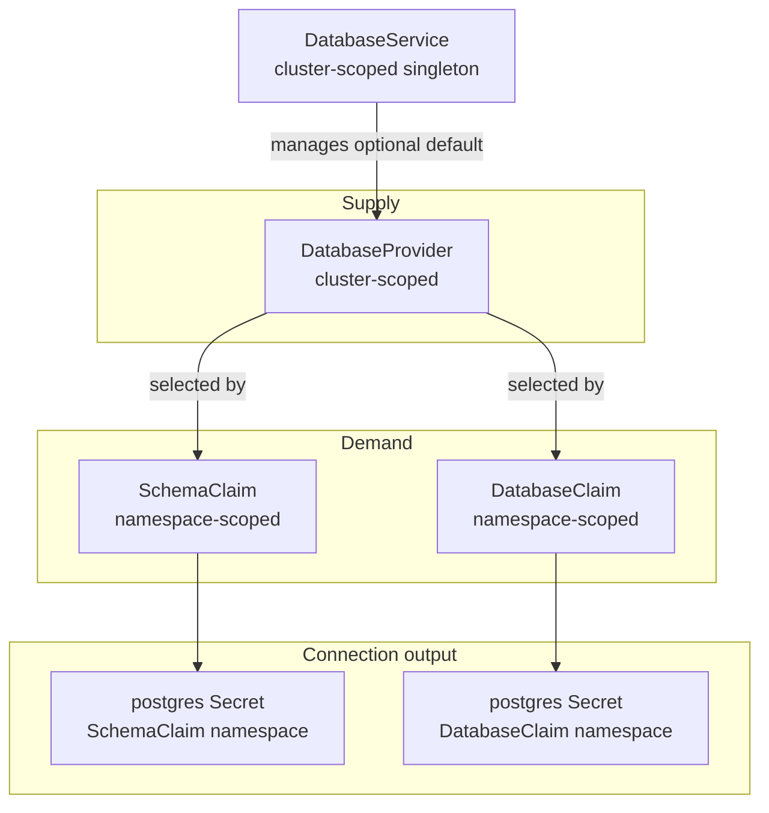
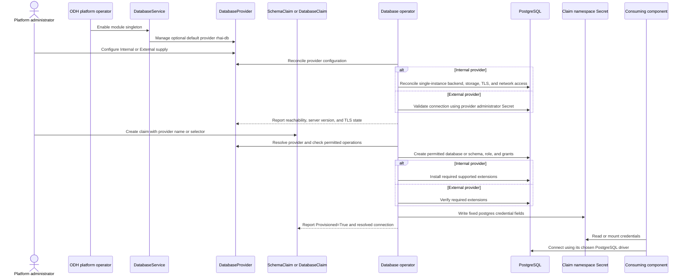
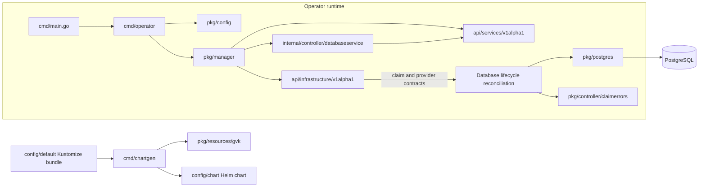

# Architecture

The Open Data Hub database operator gives platform components a declarative Kubernetes API for PostgreSQL access. Without the operator, components carry separate engine assumptions, credential formats, and database lifecycles; administrators repeatedly configure endpoints and credentials and accumulate small independent instances. The operator provides a shared supply registry, per-component demand resources, a standard connection Secret, and an optional platform-managed default backend.

## Platform role

This operator runs as an ODH platform module. The platform operator manages module enablement through the cluster-scoped `DatabaseService` singleton in `services.platform.opendatahub.io/v1alpha1`; the database supply and demand APIs are in `infrastructure.opendatahub.io/v1alpha1`. The module boundary leaves platform-wide enablement to the ODH operator and gives this service ownership of database provider and claim lifecycles. See the [shared database service ADR](https://github.com/opendatahub-io/architecture-decision-records/blob/main/architecture-decision-records/operator/ODH-ADR-Operator-0017-shared-database-infrastructure-service.md) and the ODH operator's [module orchestration overview](https://github.com/opendatahub-io/opendatahub-operator/blob/main/internal/controller/modules/README.md) for the general module pattern.

## Domain model

The API separates database supply from database demand. `DatabaseService` controls the module and its optional default provider; providers describe available PostgreSQL backends; claims request isolated access and produce a namespace-local connection Secret.

`DatabaseProvider` is the supply-side abstraction. A provider can point to an administrator-managed PostgreSQL instance or describe the operator-managed Internal backend. Claims select a provider by exact name or label selector. When several providers match, the operator selects the one with the greatest `db.infrastructure.opendatahub.io/selection-priority` value and breaks ties alphabetically; a bound claim stays with its provider while that provider matches.

`SchemaClaim` requests a dedicated schema and login role within a database, using the provider default database when no database is named. `DatabaseClaim` requests a database-scoped role for a named database or the provider's default database; it can request a dedicated database when provider capabilities permit creation. Both kinds declare access level and required PostgreSQL extensions. The default `ReadWrite` access is bounded to the claim's schema or database, while `ReadOnly` grants read-only access.

`DatabaseService` is the cluster-scoped module-enablement singleton. When enabled with default-provider management, it supplies the well-known `rhai-db` Internal provider so components have a working shared default without administrator database setup. Administrators can add other providers and direct claims to them when they need different durability, performance, or isolation characteristics.

## Provisioning flow

Provider reconciliation establishes a reachable backend before the operator fulfills claims. For each claim, the operator resolves its provider, checks permitted operations, provisions the requested database resources and role, and writes credentials where the consuming component can read them.

The operator reports PostgreSQL server version as provider information rather than enforcing a platform-wide version floor. Components own their SQL feature requirements, while the claim extension list expresses concrete capabilities such as `vector` availability.

## Provider backends

| Provider | Architectural role | Provisioning and operational boundary |
| --- | --- | --- |
| `Internal` | Platform-managed convenience PostgreSQL backend | The operator owns a single-instance PostgreSQL deployment and its persistent storage. It manages TLS through cert-manager and installs claim-requested extensions from the supported allow-list. It provides neither high availability nor automated backup and restore. |
| `External` | Administrator-managed PostgreSQL instance | The operator validates and provisions claim resources through the administrator connection Secret, subject to provider capabilities; it never manages the server lifecycle. The administrator owns instance availability, network policy, TLS configuration, and extension installation. The operator verifies required extensions and reports missing ones. |

Both provider types are supported choices. Multiple providers allow administrators to assign components to different failure and performance domains without changing the claim contract. Removing module or provider management retains Internal backend storage and database state; administrators must explicitly delete that data.

## Credential contract

When the operator fulfills a claim, it writes an `Opaque` Secret in the claim's namespace and annotates it with `opendatahub.io/connection-type-protocol: postgres`. Its stable fields are `host`, `port`, `user`, `password`, `dbname`, and `sslmode`; `SchemaClaim` adds `schema`, and providers with a CA add `ca.crt`. The Secret is a PostgreSQL Connection API artifact, so consumers use the same contract for claim-generated and administrator-authored credentials.

The contract exposes discrete fields and no composed URI. Drivers differ in URI syntax and schema handling, and a URI alongside its component fields would create two representations that could drift; consumers assemble the format their driver requires from the canonical fields. A `SchemaClaim` consumer must apply the `schema` value when connecting or qualifying its SQL.

For TLS, Internal providers use cert-manager-issued server certificates (or a provider-scoped self-signed issuer), while External providers supply their CA and SSL mode through administrator configuration. The generated Secret carries trust material, not a filesystem path; each consumer mounts `ca.crt` and configures its driver's trust-root path.

## Repository components

The Go packages divide module startup, Kubernetes reconciliation, API contracts, PostgreSQL operations, and chart packaging:

`cmd/main.go` exposes the operator and chart-generation commands. `cmd/operator` loads module configuration and starts the controller-runtime manager. `pkg/config` combines compiled defaults, the mounted module ConfigMap or configuration file, environment overrides, and command flags; it also provides platform release information used in module status. `pkg/manager` registers Kubernetes and service/infrastructure API types in the runtime scheme, configures metrics, health and readiness checks, leader election, and registers the `DatabaseService` reconciler.

`internal/controller/databaseservice` connects the `DatabaseService` singleton to the ODH platform-utilities reconciliation framework. It handles module-level status and release reporting and the service-level retry policy. The API packages define the contracts that reconciliation consumes and publishes: `api/services/v1alpha1` contains the module singleton, and `api/infrastructure/v1alpha1` defines `DatabaseProvider`, `SchemaClaim`, `DatabaseClaim`, their shared provider-selection and access types, and their observed connection status.

PostgreSQL provisioning uses `pkg/postgres` for pgx connections, TLS validation, safe DDL, role and privilege management, extension operations, and discrete Secret-field parsing. `pkg/controller/claimerrors` supplies typed errors for missing databases and provider-denied database or schema creation so claim status can describe unsatisfied requests. `pkg/resources/gvk` centralizes Kubernetes kind identifiers used when the chart generator transforms resources.

`cmd/chartgen` converts the multi-document output of `kustomize build config/default` into `config/chart`, the Helm packaging format used for module installation. It derives Helm values from the operator Deployment and configuration ConfigMap, templates release namespace and operator settings, and places CRDs in Helm's CRD directory. This makes the Kustomize resource bundle the source for the generated module chart and avoids a separate copy of installation resources.

At runtime, the operator depends on the Kubernetes API, controller-runtime, and the ODH platform-utilities module framework. The operator uses pgx for PostgreSQL access and cert-manager for the Internal provider's certificate lifecycle; Kustomize and Helm define the manifest-to-module-packaging boundary. The Internal backend is a convenience PostgreSQL service rather than a dependency on a separate database operator.

## Lifecycle and security boundaries

The operator creates a unique PostgreSQL role and password for each claim and stores the connection Secret only in that claim's namespace. The operator grants the role privileges only on the resources named by the claim. Kubernetes RBAC for claim creation determines which principals can request access to cluster-scoped providers; consuming workloads access their own namespace's Secret through their chosen Kubernetes mechanism.

For Internal providers, a NetworkPolicy restricts PostgreSQL ingress to namespaces with active provisioned claims. External-provider network isolation remains the administrator's responsibility. The operator sets TLS defaults per connection: in-cluster traffic to Internal backends uses `verify-full` when TLS is configured and `disable` otherwise; an External provider's administrator connection for provisioning defaults to `require` when its `sslmode` is unset. For claims bound to External providers, the consumer-side `sslmode` is governed by the administrator's provider configuration, not a platform-wide guarantee.

The operator keeps credentials out of logs and quotes SQL identifiers and literals before using them in DDL. Normal reconciliation repairs missing claim resources; recreating lost role credentials can issue a new password, but the service has no scheduled or user-triggered rotation workflow. Claim deletion preserves underlying database data by default and never deletes a shared provider-default database. Components own their application DDL, schema versioning, and movement of existing data.

## Stable contracts

Resource names and scope are deliberate API constraints: `DatabaseService` and `DatabaseProvider` are cluster-scoped, while `SchemaClaim` and `DatabaseClaim` are namespace-scoped. Kubernetes cannot change a released CRD's scope without introducing a new kind and migrating users. The fixed `DatabaseService` singleton name is `default-db-operator`. Provider configuration identifies PostgreSQL; kind names remain engine-neutral—`DatabaseService`, `DatabaseProvider`, `SchemaClaim`, and `DatabaseClaim`.

The [Credential contract](#credential-contract) defines the fixed Secret key names. The initial configuration sets the default provider name to `rhai-db`, which remains stable once components and claims depend on it.
